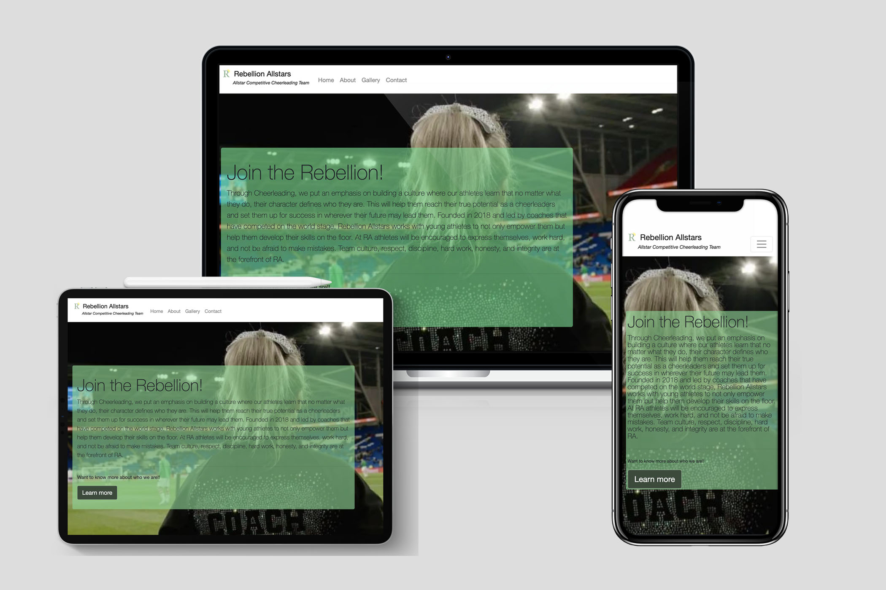
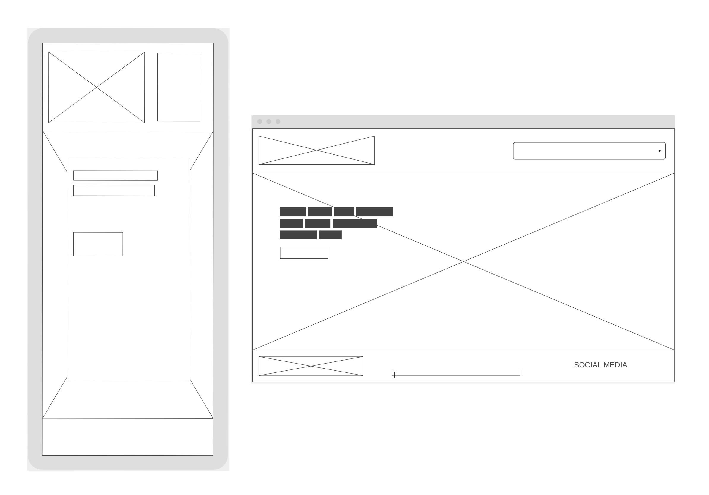

# Rebellion Allstars

## Welsh competitive cheerleading team, first project

<a href="https://nccadman19.github.io/rebellionallstarscheer/" rel="nofollow" target="_blank">Visit the website here</a>

This is my first project and I am very worried on how this is going to turn out! This project is for my cheerleading team, it provides extra credibility for the team by having an online presence in website form. 

This website is made up of the following sections:

Home

1. Navbar with logo, name of cheer team and nav bar links to other pages
2. A paragraph about rebellion allstars
3. Footer with copyright and social media links

About Us

1. Information about the team and a team photo
2. List of the head coaches on the team and their positions

Gallery

1. A carousel of images from cheer sessions and competitions

Contact

1. A contact form for people to contact regarding using us for promotional material or joining a team. 

My business goals for this website are:

1. To show off the team and what we can do
2. To create a point of contact for new members
3. To promote the team to others and nationally for promotion events (such as football games) 

The user goals of this website are:

1. To be able to find out information on who rebellion allstars are
2. To see who the coaches are
3. To see what the gyms look like and what we look like as a team to entice the user to join our team 
4. To view the talents of the team and possibly want to use us for an event 

## Strategy

Considering the core UX principles I first started to think about the strategy for this website and defined who the target users would be and what features/technologies they would want.

Rebellion Allstars target users are:

Aged 10-30
Past/future cheerleaders 
People looking for cheerleaders at an event 

What these users would be looking for:

Clear, concise, easy-to-find information
Great photos of cheer that show off skills
Somewhere to contact us

## Skeleton

Wireframes

## Surface

I chose a colour palette based around the team colours, our uniforms are white, green and black and I wanted this to be reflected on the website. I paired these colours with a light grey to add something with less contrast than black for the footer. 

I used Google fonts 'Roboto', I felt 'Roboto' was very easy to read and looks professional. 

## Features

This is a fully responsive website that was designed mobile-first as this is the most likely way it will be viewed; the website is divided into the four sections listed in the navbar. All of the headings use the font Roboto and the body too, this consistency has been used across the website to create a coherent design.

### Navbar

The navbar is comprised of a logo and navigation links to the other pages on the site. The logo is comprised of colours that match our logo and I felt that a white background would look best with this. 

### About

This is where I introduce the owner of the club, when it was founded and a little about our teams and achievments. I also use this page to introduce the head coaches on the team with images of them. 

### Gallery

This page has a carousel that showcases the work we do at Rebellion Allstars. 

### Contact Us

This is a contact page for people to contact us regarding joining the team and also enquiring about booking us for events. 

## Credits

Href links copied from nccadman19/resume-project/index.html

Help: Help from Harry Dhillon | Mentor | Software Developer @ PwC

Other pages used for help: 

Stop jumbotron from bleeding our of container when viewed on mobile: 
https://stackoverflow.com/questions/21425051/bootstrap-3-large-button-breaks-out-of-jumbotron-on-mobile-screen

How to center first about us image:
https://stackoverflow.com/questions/34908332/float-image-in-center

Image carousel:
https://getbootstrap.com/docs/4.6/components/carousel/

Remove pointer from a tag:
https://codewithhugo.com/disable-html-anchor/#:~:text=To%20disable%20a%20HTML%20anchor,events%20on%20the%20anchor%20element.&text=This%20is%20a%20great%20option,HTML%20links%20on%20a%20page.

Styling for Coaches section helped by: Harry Dhillon 

## Issues 

I thought I'd write what I would like to change but don't know how (any help appreciated)

1. I'd like the logo larger without moving everything else around. 
2. I'd like to menu to align right, cannot get it to move to the right.
3. In about us, I'd like nicer styling of the coaches section.
