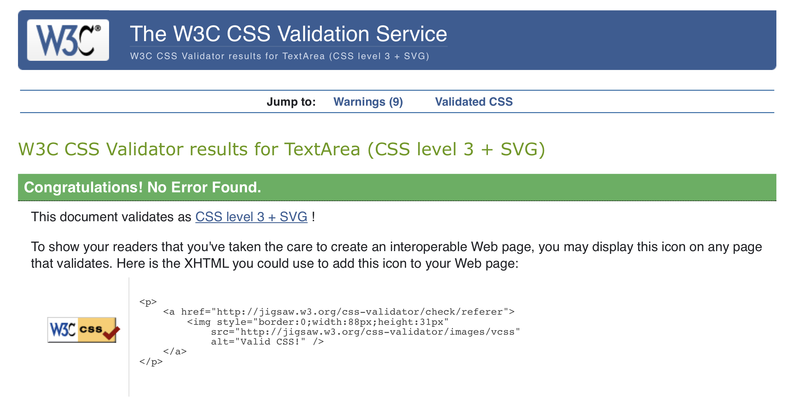

# Rebellion Allstars

## Welsh competitive cheerleading team, first project

<a href="https://nccadman19.github.io/rebellionallstarscheer/" rel="nofollow" target="_blank">Visit the website here</a>

This is my first project and I am very worried on how this is going to turn out! This project is for my cheerleading team, it provides extra credibility for the team by having an online presence in website form. 

This website is made up of the following sections:

Home

1. Navbar with logo, name of cheer team and nav bar links to other pages
2. A paragraph about rebellion allstars
3. Footer with copyright and social media links

About Us

1. Information about the team and a team photo
2. List of the head coaches on the team and their positions

Gallery

1. A carousel of images from cheer sessions and competitions

Contact

1. A contact form for people to contact regarding using us for promotional material or joining a team. 

My business goals for this website are:

1. To show off the team and what we can do
2. To create a point of contact for new members
3. To promote the team to others and nationally for promotion events (such as football games) 

The user goals of this website are:

1. To be able to find out information on who rebellion allstars are
2. To see who the coaches are
3. To see what the gyms look like and what we look like as a team to entice the user to join our team 
4. To view the talents of the team and possibly want to use us for an event 

# Testing 

## Functionality Testing 

### Validate HTML/CSS

As you can see in the HTML/CSS section I have completed all validation checks with no errors. 

### Forms

I have tested the form on both mobile and browser and there are no errors. The website returns to a blank contact form in case the user made a mistake or wants to make another enquiry. 

The contact name and email address is a mandatory field and I can confirm with testing that you cannot submit the form without some data in the field and an @ in the email field. 

## Usability Testing 

### Navigation 

I tested the navigation with the test subject being a user who wants to have a look at the coaches and apply to join the team. 

On opening the website there is initial information on the team with a clear learn more button that takes you to the about page. 

The about page gives a further breakdown of the team and also shows who the coaches are (Please see bug information that was remedied at this stage).

The contact page is then clearly in the top right hand corner (after selecting the menu on mobile) where you can click and get in contact with the team. 

### Spelling & Viewing 

I have spell checked the entirety of the site and could not find any errors. 

All static images have been testing on desktop and mobile with no issues (Please see bug information that was remedied at this stage).

The scroll bar works correctly on mobile and desktop.

### URL 

The URL contains the correct page title for each page viewed on all platforms. 

### Loading Speed 

Using pingdom I tested the load of the website on a desktop chrome browser. 

I gained the following results:

The main comment that made the score a B rating was to compress the images to load the page faster, I will keep this information noted for my next project. 

## Compatibility Testing 

I have tested the website on both chrome and safari, both of which view as intended with no errors. 

Tests on iOS mobile platforms show no errors, I have also tested using the inspect element at different sizes with no issues (Please see bug information that was remedied at this stage).

## Performance Testing 

### Web Load Testing 

I tested this function with 30 people accessing the website at once with them all submitting a contact request. The site function as expected with no time outs or errors. 

### Maintenance 

I have gone back to this site on different platforms regularly to ensure the site is viewing as intended. 

# Bugs 

After testing the site on different platforms I noticed that on safari mobile an image on the about page had not adjusted as intended to the page size. 

I remedied this issue by adding ‘class=“aboutimg”' to the image in the CSS I then added the following code to a media query for mobile:

.aboutimg { height: 60vh; }

This changed the sizing on mobile and allowed to image to be viewed as intended. 

I could have also compressed the images as noted in the loading speed testing but I was unsure how to do this and the project needed to be submitted. 

# UX

## Strategy

Considering the core UX principles I first started to think about the strategy for this website and defined who the target users would be and what features/technologies they would want.

Rebellion Allstars target users are:

Aged 10-30
Past/future cheerleaders 
People looking for cheerleaders at an event 

What these users would be looking for:

Clear, concise, easy-to-find information
Great photos of cheer that show off skills
Somewhere to contact us

## Skeleton
--------------

Wireframes

## Surface
-------------

I chose a colour palette based around the team colours, our uniforms are white, green and black and I wanted this to be reflected on the website. I paired these colours with a light grey to add something with less contrast than black for the footer. 

I used Google fonts 'Roboto', I felt 'Roboto' was very easy to read and looks professional. 

## Features
--------------------

This is a fully responsive website that was designed mobile-first as this is the most likely way it will be viewed; the website is divided into the four sections listed in the navbar. All of the headings use the font Roboto and the body too, this consistency has been used across the website to create a coherent design.

### Navbar

The navbar is comprised of a logo and navigation links to the other pages on the site. The logo is comprised of colours that match our logo and I felt that a white background would look best with this. 

### About

This is where I introduce the owner of the club, when it was founded and a little about our teams and achievments. I also use this page to introduce the head coaches on the team with images of them. 

### Contact Us

This is a contact page for people to contact us regarding joining the team and also enquiring about booking us for events. 

## HTML and CSS Validation 
---------------

I validated both my HTML and CSS code multiple times whilst building the website, I did this so that there were not a huge amount of errors/warnings at the final stages of development for me to deal with. This allowed me to incrementally improve my code and upon completion, there were 0 errors found.

# Changes
------------

Made the executive decision to remove the gallery page as it only needs to be 3 pages long and the issues were going to add too much work to sort before the submission date. 
Changed hero image as I felt it was a little pixelated 

## Technologies Used
-------------

I have used several technologies that have enabled this design to work:

* HTML Used as the basic building block for the project and to structure the content.

* CSS Used to style all the web content across the project.

* Bootstap Used for the responsive navbar, jumbotron, footer layout and contact page. 

* Google Fonts Used to obtain the fonts linked in the header, fonts used were Roboto. 

* Font Awesome Used to obtain the social media icons used in the footer. 

* GitHub Used to store code for the project after being pushed.

* Git Used for version control by utilising the Gitpod terminal to commit to Git and Push to GitHub.

* Gitpod Used as the development environment.

* Wireframe.cc Used to create the wireframes for the project.

* Pexels Used to get a better hero image for main and about page. 

* W3C Markup Validation Service Used to validate all HTML code written and used in this webpage.

* W3C CSS Validation Service Used to validate all CSS code written and used in this webpage.

## Credits
--------------

Href links copied from nccadman19/resume-project/index.html

Help: Help from Harry Dhillon | Mentor | Software Developer @ PwC

Other pages used for help: 

Stop jumbotron from bleeding out of container when viewed on mobile: 
https://stackoverflow.com/questions/21425051/bootstrap-3-large-button-breaks-out-of-jumbotron-on-mobile-screen

How to center first about us image:
https://stackoverflow.com/questions/34908332/float-image-in-center

Remove pointer from a tag:
https://codewithhugo.com/disable-html-anchor/#:~:text=To%20disable%20a%20HTML%20anchor,events%20on%20the%20anchor%20element.&text=This%20is%20a%20great%20option,HTML%20links%20on%20a%20page.

Styling for Coaches section helped by: Harry Dhillon 

Template for README helped using Daisy Gunn porfolio 1 pages 
